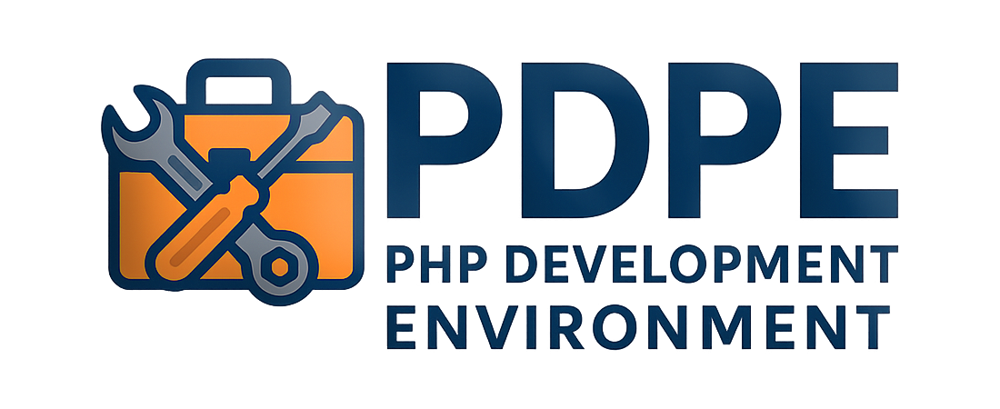

<p align="center">

</p>

<p align="center">
  <a href="https://www.docker.com/">
    
  </a>
  <a href="https://hub.docker.com/r/jmeiracorbal/pdpe">
    
  </a>
  <a href="https://www.php.net/">
    
  </a>
  <a href="https://containers.dev/">
    
  </a>
  <a href="#">
    
  </a>
  <a href="#">
    
  </a>
  <a href="https://github.com/jmeiracorbal/pdpe-php-docker-portable-environment/actions/workflows/ci.yml">
    
  </a>
  <a href="https://opensource.org/licenses/MPL-2.0">
    
  </a>
</p>

PDPE (PHP Docker Portable Environment) is a fully containerized and extensible environment to build, run, and manage PHP applications using Docker and Apache. 
It supports DevContainers and offers clean separation between infrastructure and code. Designed for developers who want a multi-project setup with optional stacks like MySQL, MongoDB, and integrated dashboards to monitor resources.

## 🚀 Getting started

> The PHP version for this project is stablished on php 8.3.

Inspired by Laravel Valet, this project is built as a starter kit to work with a PHP application environment over Apache, designed to support multiple applications within the same container. The structure allows seamless switching between development and production modes, with support for modern development workflows and service integrations (e.g., MySQL, MongoDB).

## 🧱 Usage considerations

- **Production**: Use this project if your applications are meant to be deployed together or with shared infrastructure. Each app should have a valid reason to coexist in the production stack.
- **Development**: You can use this environment to host multiple unrelated applications. It’s recommended to simulate a realistic architecture (monorepo, microservices, etc.). If running multiple instances of this environment locally, adjust the exposed ports in the `.env` file to avoid conflicts.

### 📦 Clone and initialize

Clone the repository and build the development environment locally using the compose file:

```bash
git clone https://github.com/jmeiracorbal/pdpe-php-docker-portable-environment.git
```

```bash
cd pdpe-php-docker-portable-environment
```

```bash
docker compose -f etc/docker/stacks/development/docker-compose.yml up -d
```

This gives you a full-featured development environment with support for Xdebug, MySQL, and phpMyAdmin. Devcontainers are also supported. Check the other available stacks.

💡 Tip: If using this project as a starter kit, delete the .git folder after cloning to detach it from this repository and copy the .env.example and rename to .env.

🧪 **Launch the environment**

```bash
docker compose up -d
```

Then open http://localhost:19874 (or the first value configured in `APACHE_PORT_RANGE` if customized).

📦 **Deployment modes: Dev & Prod**

This environment supports two clearly separated deployment profiles:

🧪 **Development profile**

- Active by default (web service).
- Uses bind mounts for htdocs/ -> changes are reflected live.
- Includes debugging tools like Xdebug.
- Enables additional development services (e.g., phpmyadmin, mongo-express) via --profile dev.

You can extend the default environment using compose override files:

```bash
docker compose -f docker-compose.yml -f docker-compose.override.mysql.yml --profile dev up
```

🚀 **Production profile**

- Requires explicit –profile flag prod.
- No volume mounts — source code is copied during image build.
- Suitable for CI/CD pipelines or production-ready containers.

```bash
docker compose --profile prod up
```

🔐 Be sure your htdocs contains a valid application structure aligned with host file for apache server conf before building the production image.

### 🐳 Use the published image (without cloning the repo)

If you prefer not to clone this repository, you can use the Docker image directly in your own project with a custom docker-compose.yml. 

This approach is ideal if you want to treat this environment as a service layer and manage your own codebase and configuration separately. 

📁 Minimal folder structure expected:

```
pdpe/
├── .env
├── docker-compose.yml
├── htdocs/
│   └── your-app/
│       └── public/
└── apache/
    └── sites-available/
        └── your-app.conf
```

📄 Example docker-compose.yml:

```yaml
services:
  web:
    image: jmeiracorbal/pdpe:latest
    ports:
      - "${APACHE_PORT_RANGE}:${APACHE_PORT_RANGE}"
    volumes:
      - ./htdocs:/var/www/html
      - ./apache/sites-available:/etc/apache2/sites-available
    environment:
      - XDEBUG_MODE=develop,debug
      - XDEBUG_CLIENT_HOST=host.docker.internal
```

You can adjust these paths in the volume mappings, but these are the expected defaults in the official image.

📦 Requirements:
- Define `APACHE_PORT_RANGE` in your .env file (example 19874-19899).
- Create your virtual hosts under apache/sites-available.
- Make sure the internal structure inside htdocs/ follows the convention: each app in its own folder with a public/ entry point.

🧠 **DevContainer support**

This environment includes optional DevContainer definitions located in `.devcontainer` folder, allowing you to open the project directly in VS Code or PhpStorm with remote development features.

- Preconfigured workspace with PHP tools, extensions, and Xdebug
- Composer install triggered automatically on startup
- PhpStorm Remote Development and VS Code DevContainers support

📎 If your IDE requires a `devcontainer.json` file in the root (PhpStorm, for example), you can symlink one of the predefined configs:

```bash
ln -sf .devcontainer/devcontainer.mysql.json .devcontainer/devcontainer.json
```

## 🧱 **Dockerfile: PHP + Apache**

This project uses a multi-stage Dockerfile to build reusable PHP environments for both development and production.

🔧 **Base configuration**

_Base image php:8.3-apache_:
- PHP extensions: pdo_mysql, gd, mbstring, bcmath, pcntl, exif.
- MongoDB support: Installed via pecl install mongodb.
- Composer: Included from the official Composer image.

_Apache configuration_:
- mod_rewrite enabled
- Custom virtual hosts from sites-available/*.conf
- Log forwarding: Apache logs are redirected to stdout / stderr for Docker log compatibility

🐞 **Development stage**

- Includes Xdebug with sensible defaults.
- develop,debug modes.
- `client_host=host.docker.internal`
- `start_with_request=yes`

📦 **Production stage**

- Application code is embedded into the image
- No volume bindings
- Uses the same Apache configuration and vhost layout

## ⚙️ **Environment variables**

This project uses a `.env` file to configure the exposed ports and service credentials.
These variables are not related to your PHP applications, and should only be used to configure the platform itself.

```.env
# Apache
APACHE_PORT_RANGE=19874-19899

# MySQL
MYSQL_ROOT_PASSWORD=root
MYSQL_DATABASE=app
MYSQL_USER=user
MYSQL_PASSWORD=pass
MYSQL_PORT=3306

# PhpMyAdmin
PMA_PORT=8080

# MongoDB
MONGO_ROOT_USER=root
MONGO_ROOT_PASSWORD=example
MONGO_PORT=27017

# Mongo Express
MONGO_EXPRESS_USER=admin
MONGO_EXPRESS_PASSWORD=admin123
MONGO_EXPRESS_PORT=8081
```

📍 **.env file location**

Docker Compose automatically loads the file from the directory where the command is executed.
To ensure DevContainers, PhpStorm, or CI/CD pipelines work properly:

- Keep the `.env` file at the project root (alongside docker-compose.yml)
- Always run docker compose from the project root, even if the compose files are stored in a subdirectory.

```bash
docker compose -f docker-compose.yml -f etc/docker/stacks/development/docker-compose.override.mysql.yml --profile dev up -d
```

## 🧭 **Interactive deployment menu**

> This feature is under development, is probably that doesn't work correctly or as you expected.

This project includes a Makefile with an interactive menu to simplify common deployment workflows without having to memorize commands.

To start:

```bash
make
```

Select the option that you want to deploy the base environment or variants (MySQL, MongoDB, etc.).

- make up / make down -> only webservice.
- make up-mysql / make down-mysql: web + mysql + phpmyadmin.
- make up-mongo / make down-mongo: web + mongo + mongo-express.
- make clean: down and remove volumes.
- make destroy: This removes all your docker content if’s not in use.

ℹ️ This menu is only intended for development environments and uses the dev profile internally. See Deployment modes for details about profiles.

## 📁 **Project structure**

This project is organized into separated layers:

* System and infrastructure.
* Applications source code.

```text
.
├── etc/                  # System infrastructure files
│   └── docker/
│       ├── apache2/      # Default dockerfile environment configuration
│       └── stacks/       # Dockerfiles (e.g., PHP 8.3 + Apache)
├── htdocs/               # Root directory for PHP applications
│   └── myapp/            # Each app has its own subdirectory and public entrypoint
│       └── public/
└── .devcontainer/        # DevContainer definitions for various environments
```

🔒 Note: Generated apps and vhosts are ignored via .gitignore to avoid tracking local-only changes.

🔹 **Layers purposes**

- etc: Contains all environment and system-level .configuration (Dockerfiles, Apache vhosts, Compose files…).
- htdocs: Application layer. Each project should follow a standard layout (public/, composer.json, etc.). Fully compatible with Laravel, Symfony, Slim and other frameworks.
- devcontainer: Contains DevContainer definitions for different runtime combinations (e.g., MySQL, MongoDB). Supports reproducible environments in PhpStorm and VS Code.

🧩 **Optional service stacks**

This project supports additional services through modular override compose files, allowing you to plug in tools like MySQL, MongoDB, and admin interfaces with minimal configuration.

All variants rely on the default web service and apply only to the development profile (--profile dev).

Gracias por el apunte. Aquí tienes el bloque corregido en inglés, con una redacción más natural y adecuada para usuarios desarrolladores, sin sonar artificial ni sobreexplicado:

🔌 Script generate new apps and virtual hosts

If you cloned the repository, you can use the helper script to create new  PHP apps with their Apache vhost config automatically:

By running a single command, you get:

- A new project folder inside htdocs.
- A matching Apache VirtualHost file under etc/docker/apache2/sites-available using a template (`templates/apache2/sites-available/vhost.conf.template`).
- An available port automatically assigned from your configured `APACHE_PORT_RANGE`.

📄 Example usage:

```bash
./create-project.sh myapp
```

This creates:
- htdocs/myapp/public/index.php (myapp because is the name indicated to the script) with a basic PHP starter file (php-info).
- myapp.conf pointing to /var/www/html/myapp/public because you should manage your core outside of the public folder.
- Automatically assigns a free port and injects it into the vhost.

ℹ️ Docker will pick up new vhosts automatically on container restart but you need to build the image to create the symlink logic inside the Dockerfile:

```bash
docker compose down && docker compose up -d --build
```

✋ Your custom apps and vhosts won’t be tracked by Git because are ignored on .gitignore rules.

## 🏗️ **Stacks: Development vs Production**

The project separates stack environment definitions in a modular way:

- `stacks/development`: contains ready-to-use override files for development (mysql, mongo, etc.).
  Used by DevContainers and interactive menu (make).
- `stacks/production`: intentionally left empty.
  You can define your own stack here, designed to run prebuilt apps (deployed elsewhere) and exposed via Apache reverse proxy.

💡 In production, the htdocs folder should be empty because the projects must be defined in your production stack (with Docker). This is only a recommendation. Applications are expected to be exposed through this environment, not hosted inside it.

🐬 **MySQL + phpMyAdmin**

```bash
docker compose -f docker-compose.yml -f docker-compose.override.mysql.yml --profile dev up
```

This stack includes:

- mysql: preconfigured with credentials from `.env`.
- phpmyadmin: available only if profile dev is specified.
- web: main PHP + Apache environment.

Access URLs:

- http://localhost:19874 -> The dashboard (if you use the 19874 port as first).
- http://localhost:8080 -> phpMyAdmin UI.

🍃 **MongoDB + Mongo Express**

```bash
docker compose -f docker-compose.yml -f docker-compose.override.mongodb.yml --profile dev up
```

This stack includes:

- mongo: with authentication using `.env` credentials.
- mongo-express: browser-based DB interface.
- web: PHP + Apache.

Access URLs:

- http://localhost:19874 -> The dashboard (if you use the 19874 port as first).
- http://localhost:8081 -> Mongo Express.

Login: Use `MONGO_EXPRESS_USER` and `MONGO_EXPRESS_PASSWORD` from `.env` file

🧱 You can create new override files for other technologies (Redis, PostgreSQL…) following the same pattern.

💡 The stacks must be under php base environment (check the actual version). If your stack achieves with this condition, you can send a pull-request to add to the available stacks.

📊 **Stack resource monitoring**

By default, the main environment port (`19874`) is assigned to [Glances](https://github.com/nicolargo/glances),  
a lightweight monitoring dashboard used to inspect system resources inside the container.

Glances runs as an internal service and is exposed via Apache as the default virtual host.  
You can replace or extend this service if you need more advanced observability or metrics.

## 🧭 Apache virtual hosts and multi-application mapping

This environment is designed to host multiple PHP applications under a single Apache instance.

📂 Included example sites

The project includes two example applications (`example`, `api-example`) and their corresponding virtual host files  
(`example.com.conf`, `api-example.com.conf`) under `htdocs` and `sites-available`.

These examples show how to structure your applications and vhost configurations.

⚠️ **Recommendation**: You must remove these example directories and conf files if not needed. These files aren't required by the environment and are included for illustration purposes only.

### 🗂️ Apache directory structure

The layout follows the standard Debian/Ubuntu Apache structure:

- `sites-available`: contains all virtual host definitions
- `sites-enabled`: created automatically with symlinks to enabled hosts

📁 Example:

```text
htdocs/
├── myapp1/
│   └── public/
├── myapi/
│   └── public/

etc/
└── apache2/
│   ├── sites-available/
│   ├── sites-enabled/ (auto-generated inside container on build time)
```

ℹ️ sites-enabled only exists inside the container, not on the host.

### ⚙️ VHost activation

To avoid modifying the Dockerfile every time you add a new site, vhosts are enabled automatically via symlinks:

```Dockerfile
RUN for site in /etc/apache2/sites-available/*.conf; do \
      ln -s "$site" "/etc/apache2/sites-enabled/$(basename $site)"; \
    done
```

### 🌐 Oriented to port-based routing

Each application is bound to a dedicated Apache port, avoiding expose unsafe paths like /public.

Instead of:

- ❌ http://localhost:19874/myapp1/public

You get:

- ✅ http://localhost:19875 (myapp1)
- ✅ http://localhost:19876 (myapi)
- ✅ http://localhost:19874 (default dashboard)

All vhosts must declare their port explicitly:

```text
Listen 19875
<VirtualHost *:19875>
    DocumentRoot /var/www/html/myapp1/public
    ...
</VirtualHost>
```

### 🔧 Port configuration

You define the exposed port range in your `.env`:

`APACHE_PORT_RANGE=19874-19899`

And apply it in the compose:

```yml
ports:
  - "${APACHE_PORT_RANGE}:${APACHE_PORT_RANGE}"
```

🔒 Why not use ServerName + /etc/hosts?

- Avoids external DNS or host file edits that not depends of this project.
- Keeps apps truly isolated.
- Enables consistent dev/prod behavior.
- Prevents accidental access to vendor/, `.env`, or public/ folder content via path traversal.

## 📃 License

This project is licensed under the [Mozilla Public License Version 2.0](https://www.mozilla.org/en-US/MPL/2.0/).  
You are free to use, modify, and distribute this stack as long as modifications to this environment remain open under the same license.
